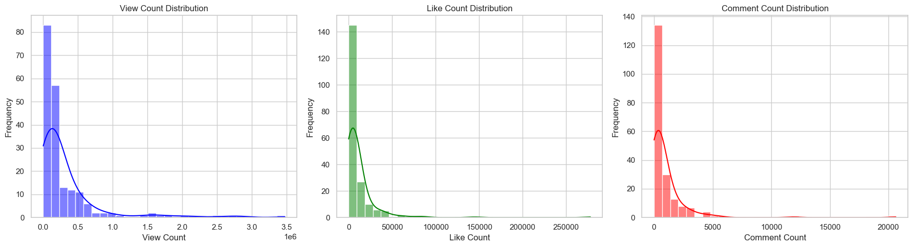

# 🎬 YouTube Trending Videos: Data Collection & Analysis

[](https://www.python.org/downloads/)
[](https://jupyter.org/)
[](https://developers.google.com/youtube/v3)
[](LICENSE)

> **Uncovering the secrets behind YouTube's trending algorithm through comprehensive data analysis of 200+ trending videos**

## 📊 Project Overview

This project provides an in-depth analysis of YouTube's trending videos to understand the key factors that drive content virality and engagement. By leveraging the YouTube Data API v3, we collected and analyzed comprehensive data from 200 trending videos in the United States, revealing actionable insights for content creators and digital marketers.

### 🎯 Key Objectives

- **Data-Driven Insights**: Analyze engagement patterns across trending YouTube videos
- **Content Optimization**: Identify optimal video characteristics for maximum reach
- **Algorithm Understanding**: Decode YouTube's trending mechanisms
- **Strategic Recommendations**: Provide actionable guidance for content creators

## 🚀 Key Findings

### 📈 Engagement Metrics Distribution

Our analysis reveals that YouTube trending videos follow a **right-skewed distribution** pattern, where most videos achieve moderate engagement while a select few reach viral status.



**Key Insights:**
- Most trending videos cluster around moderate engagement levels
- A small percentage of videos achieve exceptionally high engagement
- This pattern is consistent across views, likes, and comments

### 🔗 Strong Correlation Between Engagement Metrics

The correlation analysis demonstrates powerful interconnections between different engagement metrics:


**Correlation Strengths:**
- **Views ↔ Likes**: 0.69 (Strong positive correlation)
- **Likes ↔ Comments**: 0.85 (Very strong positive correlation)
- **Views ↔ Comments**: 0.59 (Moderate positive correlation)

This reveals a **positive feedback loop** where higher engagement in one metric drives increases in others.

## 🏆 Category Performance Analysis

### 📊 Trending Video Distribution by Category

Gaming dominates the trending landscape, but the story becomes more interesting when we examine engagement quality:


### 🎯 Average Engagement by Category

While Gaming has the most trending videos, other categories show superior per-video performance:


**Top Performing Categories:**
1. **Sports** - Highest average views, likes, and comments
2. **Music** - Strong performance across all engagement metrics
3. **Gaming** - High volume but moderate per-video engagement
4. **Entertainment** - Consistent strong performance

## ⏱️ Content Duration Impact

### 📉 The Shorter, The Better

Our analysis reveals a clear **inverse relationship** between video duration and engagement:


**Critical Findings:**
- **0-5 minute videos** achieve the highest average engagement across all metrics
- Engagement consistently decreases as video length increases
- Short-form content aligns with modern attention spans and mobile consumption

## 🏷️ Tag Strategy Analysis

Contrary to popular belief, our data shows that **tag quantity has minimal impact** on video performance:


**Key Takeaway:** Content quality and relevance matter far more than tag optimization strategies.

## ⏰ Publication Timing Analysis

### 📅 Optimal Publishing Hours

Most trending videos are published during peak hours, but timing shows weak correlation with success:


**Insights:**
- **Peak publishing window**: 2 PM - 8 PM (14:00-20:00)
- **Minimal correlation** between specific timing and engagement
- **Consistency** likely matters more than perfect timing

## 🚀 Quick Start

### 1. Clone the Repository

```bash
git clone https://github.com/yourusername/YT_DataCollectionAnalysis.git
cd YT_DataCollectionAnalysis
```

### 2. Install Dependencies

```bash
pip install -r requirements.txt
```

Or install manually:
```bash
pip install pandas matplotlib seaborn google-api-python-client isodate jupyter notebook
```

### 3. Set Up YouTube API

1. Visit [Google Cloud Console](https://console.cloud.google.com/)
2. Create a new project or select existing one
3. Enable **YouTube Data API v3**
4. Create credentials (API Key)
5. Copy your API key

### 4. Configure API Key

Open `DataCollectionAnalysis.ipynb` and replace the placeholder:

```python
API_KEY = 'your_actual_api_key_here'
```

### 5. Run the Analysis

```bash
jupyter notebook DataCollectionAnalysis.ipynb
```

Or use Jupyter Lab:

```bash
jupyter lab DataCollectionAnalysis.ipynb
```

### 6. Explore the Results

- Run all cells to reproduce the analysis
- Generated plots will be saved in the `assets/` folder
- Review insights and recommendations in the notebook

## 🛠️ Technical Implementation

### 📋 Requirements

All dependencies are listed in `requirements.txt`:

```bash
pip install -r requirements.txt
```


### 🔑 API Setup

1. **Google Cloud Console Setup:**
   - Enable YouTube Data API v3
   - Generate API key
   - Configure quotas and permissions

2. **Data Collection:**
   - Fetch trending videos metadata
   - Extract engagement metrics
   - Process and clean data

3. **Analysis Pipeline:**
   - Statistical analysis
   - Visualization generation
   - Insight extraction

### 📁 Project Structure

```
YT_DataCollectionAnalysis/
├── DataCollectionAnalysis.ipynb    # Main analysis notebook
├── trending_videos.csv             # Raw data
├── requirements.txt                # Python dependencies
├── assets/                         # Generated visualizations
│   ├── avgcontentdurationplot.png
│   ├── avgmetricscategory.png
│   ├── contentdurationplot.png
│   ├── timeviewsplot1.png
│   ├── timeviewsplot2.png
│   ├── trendingvideoscategory.png
│   ├── viewslikescomments.png
│   ├── viewslikescommentscorrelation.png
│   └── viewstagscount.png
└── README.md                       # Project documentation
```

## 📈 Strategic Recommendations

### 🎯 For Content Creators

**1. Content Strategy**
- ✅ **Prioritize short-form content** (under 5 minutes)
- ✅ **Focus on high-engagement categories** (Sports, Music, Entertainment)
- ✅ **Invest in content quality** over tag optimization

**2. Engagement Optimization**
- ✅ **Encourage viewer interaction** through calls-to-action
- ✅ **Leverage positive feedback loops** between metrics
- ✅ **Create shareable, discussion-worthy content**

**3. Publishing Strategy**
- ✅ **Upload during peak hours** (2 PM - 8 PM)
- ✅ **Maintain consistent publishing schedule**
- ✅ **Optimize for mobile consumption**

### 🔬 Algorithm Insights

- **Duration Bias**: YouTube's algorithm clearly favors shorter content
- **Engagement Amplification**: High initial engagement creates viral momentum
- **Category Preferences**: Certain content types have algorithmic advantages
- **Quality Over Quantity**: Content relevance trumps optimization tactics

## 🚀 Future Enhancements

### 📊 Advanced Analytics
- **Longitudinal Analysis**: Track trending patterns over time
- **Sentiment Analysis**: Analyze comment sentiment and quality
- **Predictive Modeling**: Build trending potential prediction models

### 🔍 Extended Metrics
- **Watch Time Analysis**: Incorporate retention rates
- **Cross-Platform Correlation**: Compare with other social media performance
- **Demographic Insights**: Analyze audience characteristics

### 🤖 Automation
- **Real-Time Monitoring**: Automated trending video tracking
- **Alert Systems**: Notification for trending opportunities
- **Performance Dashboards**: Live analytics visualization

## 📊 Data Sources & Methodology

- **Data Source**: YouTube Data API v3
- **Sample Size**: 200 trending videos (US region)
- **Time Period**: Current trending snapshot
- **Analysis Tools**: Python, Pandas, Matplotlib, Seaborn
- **Statistical Methods**: Correlation analysis, distribution analysis, categorical comparison


### 📞 Connect With Me

[](https://linkedin.com/in/yourprofile)
[](https://github.com/yourusername)
[](mailto:your.email@example.com)

